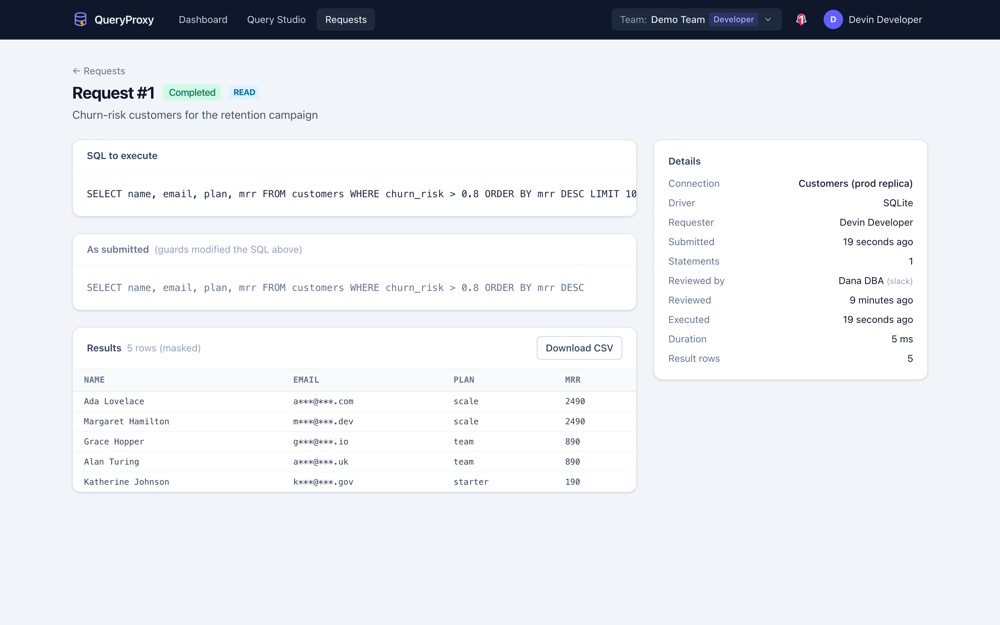
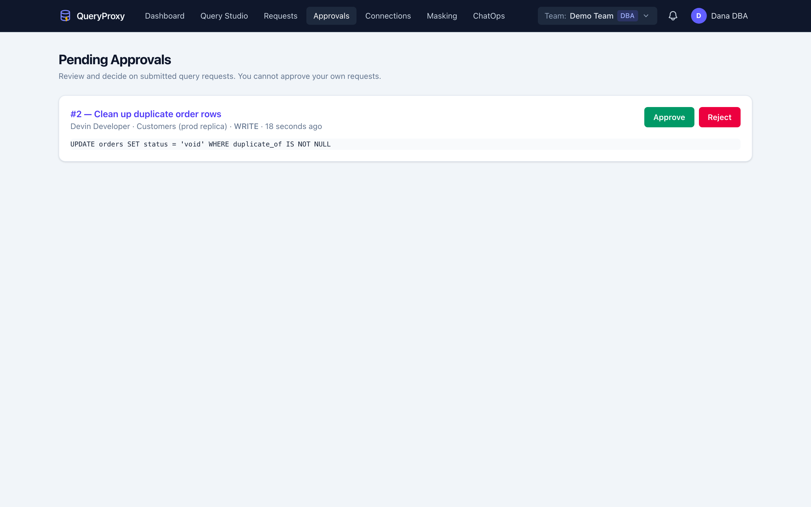
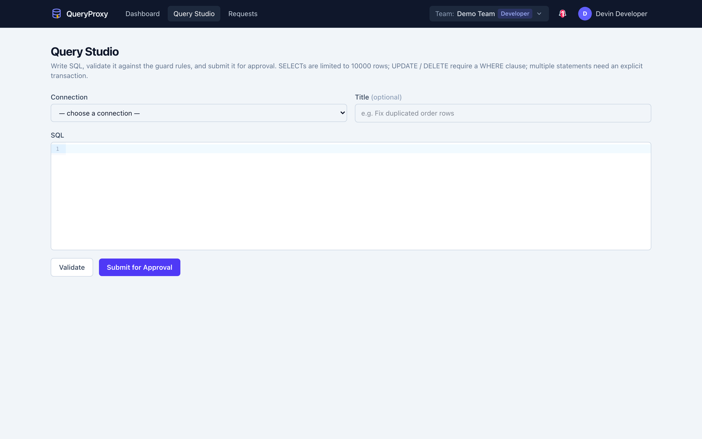

# QueryProxy

**Self-hosted database access control & query approval portal.**

QueryProxy sits between your developers and your databases. Instead of handing out
production credentials, developers submit SQL through a guarded editor; DBAs approve
or reject from the web UI or straight from Slack / Teams; approved queries run
asynchronously on a worker, and results come back **masked, limited and fully audited**.

> Built for small and mid-sized engineering teams, DevOps engineers and DBAs.
> Single Laravel monolith, zero external dependencies by default. AGPLv3.

**Website & docs: [queryproxy.com](https://queryproxy.com) · [Documentation](https://queryproxy.com/docs/)**



<details>
<summary><strong>More screenshots</strong> — the approvals queue and the Query Studio</summary>





</details>

---

## Features

- **RBAC with team isolation** — Admin / DBA / Developer / Auditor roles; every
  connection, request, masking rule and audit trail is scoped to a team.
- **Connection vault** — target database credentials (PostgreSQL, MySQL, MariaDB,
  SQL Server, SQLite) are AES-256-encrypted at rest; developers only see
  connections a DBA explicitly granted them.
- **Guarded Query Studio** — CodeMirror SQL editor with server-side AST guards:
  - `UPDATE` / `DELETE` without `WHERE` are rejected at submission,
  - `SELECT` without `LIMIT` gets `LIMIT 1000` injected (hard cap `10000`),
  - multiple statements require an explicit `BEGIN; ...; COMMIT;` transaction,
  - administrative statements (`GRANT`, `DROP DATABASE`, `SET GLOBAL`, ...) are blocked.
- **Approval workflow** — pending requests wait indefinitely until a DBA decides;
  self-approval is blocked; every decision records who, when and through which channel.
- **ChatOps** — Slack messages with interactive **Approve / Reject** buttons
  (HMAC-SHA256 signature + replay-window verification on every callback) and
  Microsoft Teams cards with an HMAC-verified action endpoint.
- **Async execution** — approved queries run on a queue worker; reads stream
  through database cursors into NDJSON files with constant memory usage.
- **Dynamic data masking** — column-pattern and content-regex rules
  (full / partial / hash strategies) applied *while results are written*,
  so unmasked PII never reaches the result store.
- **Result viewer** — paginated browser + streamed CSV export, with retention pruning.
- **Immutable audit log** — every login, grant, submission, decision, execution and
  download; filterable auditor UI with CSV export.

## Quick start (Docker)

```bash
git clone https://github.com/QueryProxy/QueryProxy.git
cd QueryProxy
docker compose up
```

Prefer a prebuilt image? Every release is published to GitHub Container
Registry as `ghcr.io/queryproxy/queryproxy` (`latest` and per-version tags) —
point the compose services' `image:` at it instead of `build: .`.

Open <http://localhost:8000> — with the default compose file (`QUERYPROXY_SEED_DEMO=true`)
you can log in as:

| Role | Email | Password |
| :--- | :--- | :--- |
| Admin | `admin@example.com` | `password` |
| DBA | `dba@example.com` | `password` |
| Developer | `developer@example.com` | `password` |
| Auditor | `auditor@example.com` | `password` |

Three containers start: the web app, a queue worker (executes approved queries)
and the scheduler (result retention pruning).

## Manual installation

Requirements: PHP ≥ 8.3 (pdo drivers for your target databases), Composer, Node 20+.

```bash
composer install
cp .env.example .env
php artisan key:generate
touch database/database.sqlite
php artisan migrate            # add --seed for the demo team
npm install && npm run build

php artisan serve              # web app
php artisan queue:work --queue=queries,default --timeout=310   # worker (required!)
php artisan schedule:work      # scheduler (optional)
```

> The queue worker is **not optional** — approved queries execute there (ADR-002).

## How it works

```
Developer ──▶ Query Studio ──▶ SQL guards (AST) ──▶ pending request
                                                        │
                       Slack / Teams ◀── notification ──┤
                            │                           │
                            ▼                           ▼
                     Approve / Reject ──────▶ queue ──▶ worker
                     (HMAC-verified)                    │ cursor streaming
                                                        ▼
                                        masked NDJSON result on storage disk
                                                        │
                              viewer / CSV download ◀───┘   (all steps audited)
```

## Configuration

All knobs live in `.env` (see `.env.example` for the full list):

| Key | Default | Meaning |
| :-- | :-- | :-- |
| `QUERYPROXY_SELECT_DEFAULT_LIMIT` | `1000` | LIMIT injected into SELECTs without one |
| `QUERYPROXY_SELECT_HARD_LIMIT` | `10000` | Larger LIMITs are clamped to this |
| `QUERYPROXY_EXECUTION_TIMEOUT` | `300` | Max seconds per query execution |
| `QUERYPROXY_RESULT_DISK` | `local` | Filesystem disk for result files (`s3` supported) |
| `QUERYPROXY_RESULT_TTL_DAYS` | `30` | Retention for stored results |

The application database defaults to SQLite; set the usual `DB_*` variables for
MySQL/PostgreSQL. The queue uses the database driver by default; set
`QUEUE_CONNECTION=redis` if you run Redis.

## Slack setup

1. Create a Slack app → enable **Incoming Webhooks** (pick the approvals channel)
   and **Interactivity**, pointing the request URL to
   `https://your-host/webhooks/slack/interactions`.
2. In QueryProxy: **ChatOps** (as DBA) → paste the webhook URL and the app's
   **signing secret**.
3. In **Admin → Users**, fill each reviewer's **Slack member ID** (e.g. `U0123ABC`).

Every callback is verified with Slack's `v0` HMAC-SHA256 signature scheme within a
±5 minute replay window; forged or stale callbacks are rejected with `401`.

## Teams setup

1. Add an **Incoming Webhook** to your channel and save it under **ChatOps** for
   announcements.
2. For approve/reject actions, call `POST /webhooks/teams/actions` with an
   `Authorization: HMAC <base64(hmac_sha256(raw_body, secret))>` header
   (Teams outgoing-webhook style — easy to wire from a Power Automate flow):

```json
{ "action": "approve", "request_id": 123, "actor_email": "dba@example.com" }
```

## SQL Server support

The default image ships `pdo_pgsql`, `pdo_mysql` and `pdo_sqlite`. To proxy MSSQL
targets, extend the Dockerfile with Microsoft's ODBC driver and the `sqlsrv` /
`pdo_sqlsrv` PECL extensions.

## Development

```bash
composer install && npm install
php artisan test        # Pest suite
./vendor/bin/pint       # code style
npm run dev             # Vite dev server
```

See [CONTRIBUTING.md](CONTRIBUTING.md). Product requirements and architecture
decisions live in the project's SSOT repository (PRD / ADR / MVP plan).

## Security

Please report vulnerabilities privately — see [SECURITY.md](SECURITY.md).

Highlights: encrypted credentials at rest, HMAC-verified chat callbacks, immutable
audit logs, login & webhook rate limiting, self-approval prevention, masked-at-write
result storage.

## License

[GNU Affero General Public License v3.0](LICENSE). If you run a modified QueryProxy
as a network service, you must publish your modifications under the same license.
