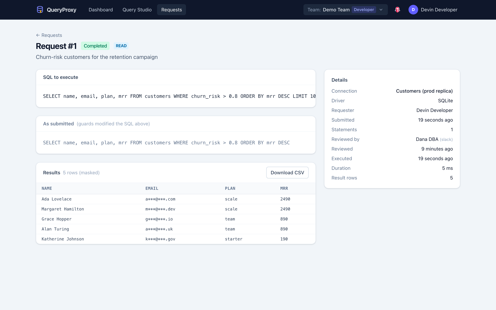
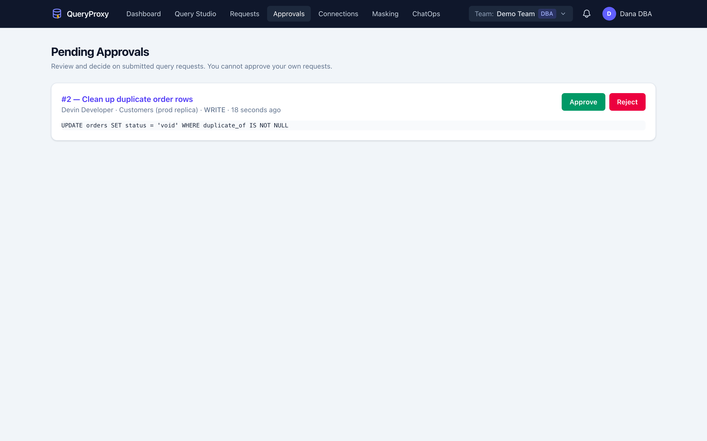
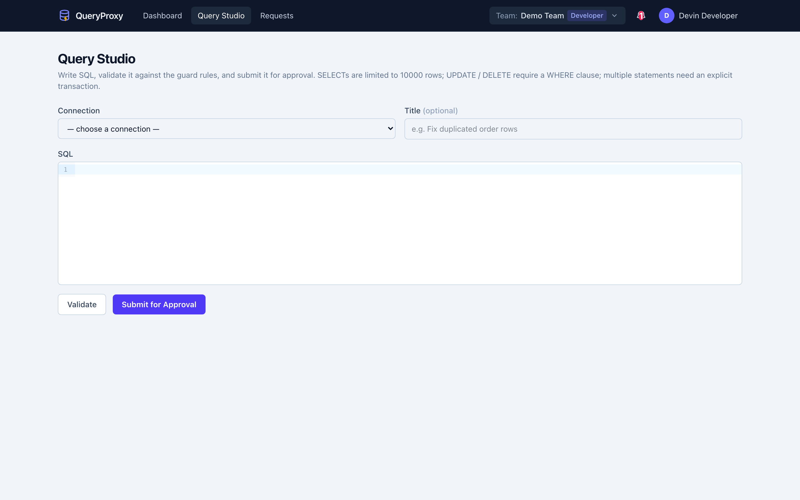

# QueryProxy

Self-hosted database access control & query approval portal.

[](https://github.com/QueryProxy/QueryProxy/actions/workflows/ci.yml)
[](https://github.com/QueryProxy/QueryProxy/releases/latest)
[](LICENSE)
[](https://muhammetsafak.com/tan/)

QueryProxy sits between your developers and your databases. Instead of handing out
production credentials, developers submit SQL through a guarded editor; DBAs approve
or reject from the web UI or straight from Slack / Teams; approved queries run
asynchronously on a worker, and results come back masked, limited and fully audited.

Built for small and mid-sized engineering teams, DevOps engineers and DBAs. It is a
single Laravel monolith with no external dependencies by default.



<details>
<summary>More screenshots: the approvals queue and the Query Studio</summary>





</details>

## Features

- **RBAC with team isolation:** Admin, DBA, Developer and Auditor roles; every
  connection, request, masking rule and audit trail is scoped to a team.
- **Connection vault:** target database credentials (PostgreSQL, MySQL, MariaDB,
  SQL Server, SQLite) are AES-256-encrypted at rest; developers only see
  connections a DBA explicitly granted them.
- **Guarded Query Studio:** a CodeMirror SQL editor with server-side AST guards.
  `UPDATE` / `DELETE` without `WHERE` are rejected, `SELECT` without `LIMIT` gets
  `LIMIT 1000` injected (hard cap `10000`), and statements that hand out
  server-level code execution or file access are blocked outright.
- **Approval workflow:** pending requests wait until a DBA decides; self-approval
  is blocked; every decision records who, when and through which channel.
- **ChatOps:** Slack messages with interactive Approve / Reject buttons and
  Microsoft Teams cards with an HMAC-verified action endpoint.
- **Async execution:** approved queries run on a queue worker; reads stream
  through database cursors into NDJSON files with constant memory usage.
- **Dynamic data masking:** column-pattern and content-regex rules (full, partial
  or hash) applied while results are written, so unmasked PII never reaches the
  result store.
- **Immutable audit log:** every login, grant, submission, decision, execution and
  download, with a filterable auditor UI and CSV export.

## Quick Start

You need Docker. Start one container that runs the whole stack:

```bash
docker run -d --name queryproxy \
  -p 7432:7432 \
  -v queryproxy-data:/var/www/html/storage/app \
  -e QUERYPROXY_ADMIN_EMAIL=you@example.com \
  -e QUERYPROXY_ADMIN_PASSWORD='choose-a-strong-password' \
  queryproxy/queryproxy
```

Open <http://localhost:7432> and log in with the address and password you set.
The container runs nginx and php-fpm (as a non-root user), the queue worker that
executes approved queries and the scheduler that prunes expired results. The
single volume holds the SQLite database, the generated `APP_KEY` and the result
files.

This setup suits evaluation. Before exposing it to a network, follow the
[production hardening guide](https://queryproxy.com/docs/production-hardening/).

## Installation

Images are published on release to Docker Hub (`queryproxy/queryproxy`) and
GitHub Container Registry (`ghcr.io/queryproxy/queryproxy`), as `latest` and
per-version tags, for `linux/amd64` and `linux/arm64`.

**Docker Compose.** [`docker-compose.yml`](docker-compose.yml) in this repository
is the same single service (`docker compose up -d`), with commented blocks for
running the worker as its own container or using MySQL / PostgreSQL for the
application database.

**Without Docker.** You need PHP 8.3 or newer (with the pdo drivers for your target
databases), Composer, and Node 20.19+ or 22.12+.

```bash
composer install
cp .env.example .env
php artisan key:generate
touch database/database.sqlite
php artisan migrate
php artisan queryproxy:create-admin
npm install && npm run build

php artisan serve              # development only
php artisan queue:work --queue=queries,default --tries=1 --timeout=310
php artisan schedule:work      # scheduler (optional)
```

The queue worker is not optional: approved queries execute there. The `--timeout`
value is `QUERYPROXY_EXECUTION_TIMEOUT` plus 10 (300 by default). Serve `public/`
through nginx and php-fpm in production. Details are in the
[manual installation guide](https://queryproxy.com/docs/manual-installation/).

## Usage

1. A developer opens the Query Studio, picks a connection a DBA granted them and
   submits SQL. The guards check the statement before anything runs.
2. A DBA approves or rejects the request in the web queue or from Slack / Teams.
3. The worker runs the approved query and writes a masked result.
4. The developer views the result in the browser or downloads it as CSV.

If you did not set the admin variables, create the first administrator by hand:

```bash
docker exec -it queryproxy php artisan queryproxy:create-admin
```

To explore with demo data, set `QUERYPROXY_SEED_DEMO=true`. It creates
`admin@example.com`, `dba@example.com`, `developer@example.com` and
`auditor@example.com`, which share one randomly generated password printed once in
the container logs (`docker logs queryproxy`). The seeder refuses to run while
`APP_ENV=production` unless you also set `QUERYPROXY_SEED_DEMO_FORCE=true`.

## How It Works

A request passes the SQL guards, waits for a DBA decision, runs on the queue worker
with cursor streaming, and lands as a masked NDJSON file that the viewer and the CSV
export read. Every step is written to the audit log. The
[introduction](https://queryproxy.com/docs/#how-it-works) has the full flow diagram.

## Configuration

Settings live in `.env`; `.env.example` lists the full set.

| Key | Default | Meaning |
| :-- | :-- | :-- |
| `QUERYPROXY_ADMIN_EMAIL` / `_PASSWORD` / `_NAME` | none | First-boot administrator; ignored once any user exists |
| `QUERYPROXY_SELECT_DEFAULT_LIMIT` | `1000` | LIMIT injected into SELECTs without one |
| `QUERYPROXY_SELECT_HARD_LIMIT` | `10000` | Larger LIMITs are clamped to this |
| `QUERYPROXY_EXECUTION_TIMEOUT` | `300` | Max seconds per query execution |
| `QUERYPROXY_RESULT_DISK` | `local` | Disk for result files (`s3` supported) |
| `QUERYPROXY_RESULT_TTL_DAYS` | `30` | Retention for stored results |
| `QUERYPROXY_REQUIRE_2FA` | `none` | Enforce TOTP 2FA: `none`, `admins`, `dba` or `all` |
| `QUERYPROXY_CHAT_INCLUDE_SQL` | `true` | Embed a SQL preview in chat notifications |
| `QUERYPROXY_RUN_WORKER` | `true` | Run the queue worker inside the container |
| `QUERYPROXY_WORKER_PROCESSES` | `1` | Number of queue workers |
| `QUERYPROXY_RUN_SCHEDULER` | `true` | Run the scheduler inside the container |
| `QUERYPROXY_SEED_DEMO` | `false` | Seed the demo team and accounts |
| `TRUSTED_PROXIES` | none | Reverse proxy IPs / CIDRs allowed to set `X-Forwarded-*` |

The application database defaults to SQLite; set the usual `DB_*` variables for
MySQL or PostgreSQL. The queue uses the database driver by default; set
`QUEUE_CONNECTION=redis` if you run Redis. The complete reference is in the
[configuration guide](https://queryproxy.com/docs/configuration/).

## Deployment

Mount a volume at `/var/www/html/storage/app`: it holds the SQLite database, the
generated `APP_KEY` and the result files. The container serves plain HTTP on port
`7432`, so put a TLS-terminating reverse proxy in front of it and set
`TRUSTED_PROXIES` to that proxy. Set `APP_KEY` explicitly and keep it stable,
because it encrypts every stored connection credential. Restrict the network path
between QueryProxy and the target databases, and give read-only teams a connection
whose database user has `SELECT` privileges only.

The [production hardening guide](https://queryproxy.com/docs/production-hardening/)
has the full checklist. The default image ships `pdo_pgsql`, `pdo_mysql` and
`pdo_sqlite`; for SQL Server targets see the
[SQL Server section](https://queryproxy.com/docs/configuration/#sql-server-targets).
Backups, upgrades and rollbacks are covered in [Upgrading](#upgrading).

## Upgrading

The container runs `php artisan migrate --force` on start, and migrations are not
reversed on downgrade. Back up before every upgrade, and read the
[changelog](CHANGELOG.md) for breaking changes first.

1. Stop the container and back up the volume (and your external database, if
   `DB_*` points to MySQL or PostgreSQL). The archive holds the `APP_KEY` next to
   the encrypted credentials, so it is written readable by its owner only; store
   it as carefully as the key itself:

   ```bash
   docker stop queryproxy
   docker run --rm -v queryproxy-data:/data -v "$PWD":/backup alpine \
     sh -c "umask 077 && tar czf /backup/queryproxy-data.tgz -C /data . && chown $(id -u):$(id -g) /backup/queryproxy-data.tgz"
   ```

2. Save the container's settings before you remove it. This keeps only the
   variables you set yourself, by dropping every line the container's image already
   defines, and writes them to a private `queryproxy.env`:

   ```bash
   (
     umask 077
     docker image inspect "$(docker inspect queryproxy --format '{{.Image}}')" \
       --format '{{range .Config.Env}}{{println .}}{{end}}' > image-defaults.env
     docker inspect queryproxy --format '{{range .Config.Env}}{{println .}}{{end}}' \
       | grep -vxF -f image-defaults.env > queryproxy.env
     rm image-defaults.env
   )
   ```

   Check that `queryproxy.env` lists the `APP_KEY`, `DB_*`, `QUERYPROXY_*` and other
   values you passed with `-e`. Once the administrator account exists, you can delete
   the `QUERYPROXY_ADMIN_*` lines; they are only used on first boot.

3. Pull the new image and recreate the container.

   > [!WARNING]
   > `docker rm` deletes the old container together with its settings. Run it only
   > after `queryproxy.env` holds **every** variable you set, especially
   > `APP_KEY` if you set one. A container started without its original `APP_KEY`
   > generates a new key, and the stored connection credentials and chat secrets
   > can no longer be decrypted.

   ```bash
   docker pull queryproxy/queryproxy:latest
   docker rm queryproxy
   docker run -d --name queryproxy -p 7432:7432 \
     --env-file queryproxy.env \
     -v queryproxy-data:/var/www/html/storage/app \
     queryproxy/queryproxy:latest
   ```

With Compose, the settings stay in the compose file. Stop the stack with
`docker compose stop`, back up as in step 1 with the volume name that
`docker volume ls` shows (Compose prefixes it with the project name, for example
`queryproxy_queryproxy-data`), then run `docker compose pull && docker compose up -d`.

To roll back, restore the backup from step 1 (and your database backup) and start
the previous version tag with the same `queryproxy.env`.

> [!WARNING]
> The second command deletes everything in the `queryproxy-data` volume before it
> extracts the backup. Check that `queryproxy-data.tgz` is the archive you want first.

```bash
docker stop queryproxy && docker rm queryproxy
docker run --rm -v queryproxy-data:/data -v "$PWD":/backup alpine \
  sh -c 'find /data -mindepth 1 -delete && tar xzf /backup/queryproxy-data.tgz -C /data'
docker run -d --name queryproxy -p 7432:7432 \
  --env-file queryproxy.env \
  -v queryproxy-data:/var/www/html/storage/app \
  queryproxy/queryproxy:0.2.4
```

## Documentation

- [Introduction](https://queryproxy.com/docs/)
- [Quick start](https://queryproxy.com/docs/quickstart/)
- [Manual installation](https://queryproxy.com/docs/manual-installation/)
- [Configuration](https://queryproxy.com/docs/configuration/)
- [Production hardening](https://queryproxy.com/docs/production-hardening/)
- [SQL guards](https://queryproxy.com/docs/sql-guards/)
- [Approval workflow](https://queryproxy.com/docs/approval-workflow/)
- [Data masking](https://queryproxy.com/docs/data-masking/)
- [Slack integration](https://queryproxy.com/docs/slack-integration/) and
  [Teams integration](https://queryproxy.com/docs/teams-integration/)

All pages are at [queryproxy.com/docs](https://queryproxy.com/docs).

## Project Status

**Beta.** QueryProxy is at version 0.2.5; breaking changes can land in any 0.y release and are listed in the [changelog](CHANGELOG.md).

## Contributing

Contributions are welcome. Read the [contributing guide](CONTRIBUTING.md) before opening an issue or pull request.

## Security

Do not report security vulnerabilities through public issues; follow the [security policy](SECURITY.md) instead.

## License

Licensed under the [GNU Affero General Public License v3.0](LICENSE).
